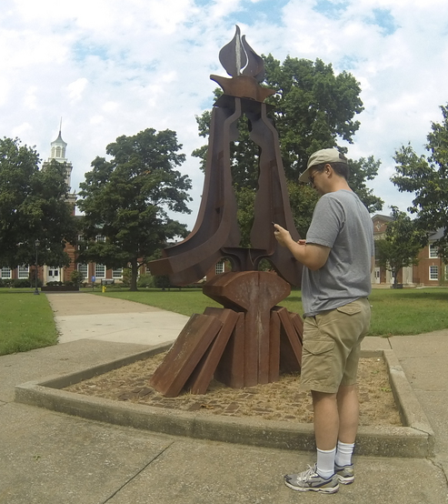
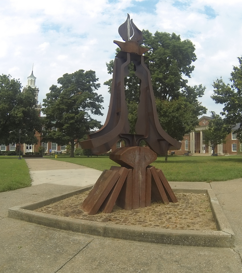

# photo-magician

"Magically" removes a person from a photo while keeping the background intact without using AI/ML.

## Demo

### Before 🤔



### After 🤯



## Try It!

On Linux:

#### 1. Build

```bash
make
```

#### 2. Run

```bash
./main
```

Note: To view PPM images, you can use [GIMP](https://www.gimp.org/)
